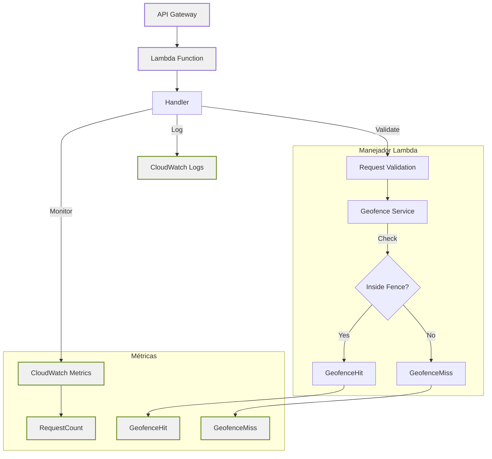

# Servicio de Geovallas con AWS Lambda

## Descripción General

Este proyecto implementa un servicio de geovallas (geofencing) serverless utilizando AWS Lambda y Go. Permite verificar si una ubicación geográfica se encuentra dentro de zonas predefinidas en ciudades mexicanas.

## Características

- Servicio serverless usando AWS Lambda
- Desarrollado en Go 1.x
- Verificación de ubicación en tiempo real
- Registro estructurado con CloudWatch
- Métricas de monitoreo integradas
- Manejo robusto de errores

## Configuración

1. Requisitos previos:

   - Go 1.x
   - AWS CLI configurado
   - Cuenta AWS con permisos necesarios

2. Instalación:

   ```bash
   git clone <repositorio>
   cd geofence-demo
   go mod download
   ```

3. Compilación:
   ```bash
   GOOS=linux GOARCH=amd64 go build -o bootstrap cmd/lambda/main.go
   zip function.zip bootstrap
   ```

## API

### Endpoint

`POST /location`

### Payload

```json
{
  "device_id": "string",
  "latitude": float64,
  "longitude": float64,
  "timestamp": "string (ISO8601)"
}
```

### Respuesta

```json
{
  "in_geofence": boolean,
  "fence_id": "string",
  "message": "string"
}
```

### Ejemplos

#### Dentro de Guadalajara

```json
// Request
{
  "device_id": "dev1",
  "latitude": 20.6597,
  "longitude": -103.3496,
  "timestamp": "2024-03-26T12:00:00Z"
}

// Response
{
  "in_geofence": true,
  "fence_id": "fence-1",
  "message": "Location check completed for device dev1"
}
```

## Monitoreo

- Logs disponibles en CloudWatch
- Métricas:
  - RequestCount
  - GeofenceHit
  - GeofenceMiss

## Arquitectura



## Flujo de Datos

1. La solicitud llega a través de API Gateway
2. La función Lambda procesa la solicitud
3. El manejador valida y limpia los datos de entrada
4. El servicio de geovallas verifica la ubicación
5. Las métricas se registran en CloudWatch
6. Se devuelve la respuesta con el estado de la geovalla

## Simulador de Pruebas

El proyecto incluye un simulador para pruebas de carga que:

- Simula 10 dispositivos enviando ubicaciones cada 500ms
- Genera movimiento aleatorio alrededor de las geovallas
- Muestra estadísticas en tiempo real:
  - Total de solicitudes
  - Solicitudes por segundo
  - Estado de cada dispositivo

### Uso del Simulador

```bash
# Ejecutar el simulador
./scripts/simulate.sh

# Detener el simulador
Ctrl+C
```
